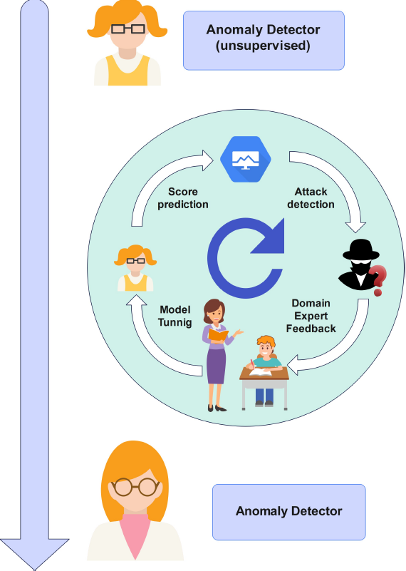
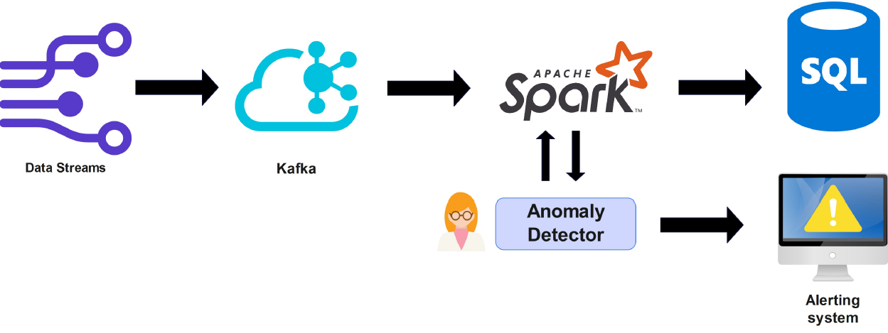

# Streaming-Time-Series-Anomaly-Detection

## Challenge
Sharif Data Days is a competition for all who are interested in Data Science and Engineering. This competition is held in two phases annually. Including an online and an on-site phase in which competitors will compete in teams of three. The only prerequisite to entering this competition is familiarity with programming and the ability to develop Deep Neural Networks. You can find more details about this competition in this [Link](https://www.linkedin.com/company/datadays2022/).

In this repository, you can find our team's final submission, which clinched **third** place in the competition's final stage held in 2022 at Sharif University of Technology. We developed our model using Python and TensorFlow.

## Anomaly detection using LSTM Autoencoders
The proposed anomaly detection system leverages a novel architecture that combines Long Short-Term Memory (LSTM) networks with an asymmetric auto-encoder for efficient anomaly detection in time-series data, with a specific focus on cloud server network traffic. The asymmetric auto-encoder, an essential component of this architecture, is specially designed to identify anomalies based on reconstruction errors. Unlike traditional auto-encoders, the asymmetric auto-encoder incorporates encoder and decoder structures intentionally imbalanced in capacity. The encoder is designed to possess higher capabilities, enabling it to effectively capture the underlying structure of normal instances while facing challenges in reconstructing anomalous patterns.

## Leveraging the proposed model to detect DDoS attacks in data streaming cloud services using Active Learning and Human-In-The-Loop

We propose an anomaly detection system for detecting DDoS attacks on a cloud service using active learning and human-in-the-loop feedback. The system combines LSTM networks with an asymmetric auto-encoder to capture temporal dependencies in time-series data. Unsupervised training is employed, and instances with high uncertainty are selected through active learning for domain expert labeling. The feedback from experts refines the model's capabilities, adapting it to evolving network conditions and data distributions. The proposed architecture offers a flexible, robust, and adaptable solution for real-time anomaly detection in cloud server network traffic, effectively mitigating the impact of concept drift and data drift. By integrating active learning and human expertise, the system continuously improves its performance, ensuring accurate detection of DDoS attacks and other anomalies in cloud services.

You can find our detailed report on this [here](./DataDays2022.pdf). An overview of our approach is visualized in the following images.

